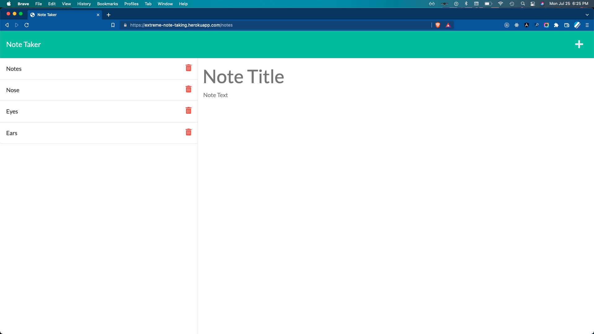
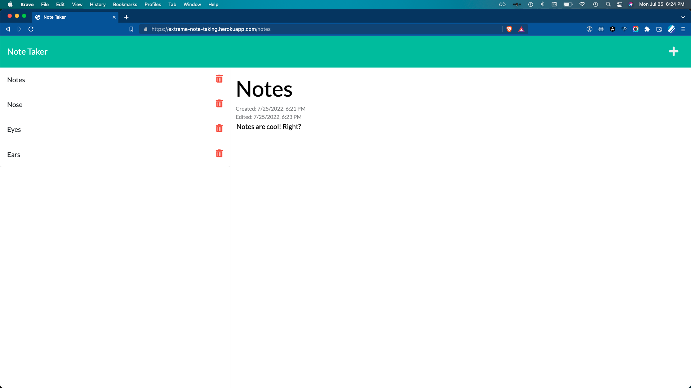

# Extreme Note Taking

## A Simple Yet Totally Sufficient Note Taking App
A simple note taking app. Users can add, edit, and delete notes. Notes are stored on the server in a .json file.

[Deployed link on Heroku](https://extreme-note-taking.herokuapp.com/)

# Table of Contents
- [Usage](#usage)
- [License](#license)
- [Contributing](#contributing)
- [Questions](#questions)

# Usage

## Creating notes
Click on the `+` to create a new note. Click the floppy disc icon to save the note.

## Editing notes
Click on the title of any note to view it. The note is directly editable.  Click the disc icon to update the note.  Notice the `Edited` datetime property is updated. 

## Deleting notes
Simply click the trash icon and say good bye forever. 

# License
This project is provisioned under the [MIT License](https://opensource.org/licenses/MIT)

# Contributing
[Repo link](https://github.com/codewizard-dt/extreme-note-taking)

Do you want to help make this project better? Visit the the repo to check out existing issues or create a new branch to start working on a suggested feature

# Questions
If you have any questions, please contact me on [Github](https://github.com/codewizard-dt) or [email](mailto:david@codewizard.app).